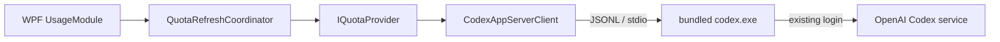

# 架构说明

## 目标与边界

Codex 额度组件是一个只读的 Windows 桌面仪表。首版界面只展示 Codex 的每周剩余额度、重置时间和最近一次成功更新时间，不展示 5 小时额度或可用额度重置次数，也不提供任何额度重置能力。

必须长期保持以下边界：

- 组件代码不打开、解析或复制 `.codex` 中的认证文件。
- 组件只通过随应用发布的官方 `codex.exe app-server --stdio` 复用现有登录。
- 客户端只允许 `initialize`、`initialized` 和 `account/rateLimits/read` 三类出站消息。
- 不开放 WebSocket 或本地网络端口，不记录原始协议载荷。
- 安装、升级和卸载只能管理组件自己的目录与快捷方式。

## 数据流

生产展示由 `WidgetPresentationCoordinator` 管理。一个 `UsageModule` 同时供桌面 `MainWindow` 和任务栏 `TaskbarCapsuleHostView` 绑定；`MainWindow` 永远是浮窗，任务栏使用创建时即指定 `Shell_TrayWnd` 为父窗口的独立 `HwndSource`，不再对透明 WPF Window 执行 SetParent。

任务栏子窗口启用 `UsesPerPixelTransparency`，校验实际分层标志；仅在安全空位显示。用户隐藏意图与布局导致的临时隐藏分开保存，20 秒布局检测不会复活主动隐藏的窗口。显示器变化、唤醒及 TaskbarCreated 通知会重新检查宿主；旧句柄失效时只重建展示，不重建数据提供者。托盘使用隐藏的顶层工具消息窗口接收广播，不创建可见任务栏按钮。旧 `TaskbarHostService` 仅保留历史探针与测试兼容，生产路径不再调用。

`CodexAppServerClient` 负责子进程生命周期、初始化握手、请求关联和更新通知；`IQuotaProvider` 负责把协议数据转换为领域模型；`QuotaRefreshCoordinator` 负责刷新频率、失败退避和新鲜度；WPF 层只消费 `QuotaDisplayState`。桌面组件保留持久 App Server 会话，但在成功读取后将子进程的空闲物理页面交还给 Windows，兼顾低常驻内存、低启动开销和实时更新通知。

应用壳使用原生通知区和显示器 API，避免为托盘加载 Windows Forms。初始化或刷新完成后，空闲调度器只回收当前进程的物理工作集，不丢弃额度状态；被回收页面需要时可由 Windows 重新载入。

## 额度映射

- 优先读取 `rateLimitsByLimitId["codex"]`，缺失时回退 `rateLimits`。
- Core 仍用 `windowDurationMins == 300` 识别 5 小时窗口以保持协议兼容，并用 `10080` 识别每周窗口，不能依赖 primary/secondary 顺序；首版 UI 只呈现每周窗口，不展示 5 小时窗口。
- `RemainingPercent = clamp(100 - usedPercent, 0, 100)`。
- Core 可继续解析可用重置次数，并且只取 `rateLimitResetCredits.availableCount`；缺失表示未知，不等同于零。首版 UI 不消费或展示该字段。
- `resetsAt` 是 Unix 秒时间戳，进入 UI 后按当前 Windows 时区格式化。

## 扩展模块

`IWidgetModule` 是看板扩展点。新增任务状态等模块时：

1. 在 Core 中增加独立的数据提供者和领域模型，不让 WPF 直接依赖协议 JSON。
2. 在 App 中实现新的模块视图模型和视图。
3. 在组合根注册模块，由窗口壳统一控制可见性与刷新生命周期。
4. 若需要新的 App Server 方法，为它建立独立的最小允许列表和协议测试；不得扩大额度模块的权限。

首版不做运行时插件加载，避免在个人桌面组件中引入不必要的代码执行面。模块以编译期注册方式扩展。

## 本地文件

- 安装目录：`%LOCALAPPDATA%\Programs\CodexQuotaWidget`
- 设置和脱敏日志：`%LOCALAPPDATA%\CodexQuotaWidget`
- 开机启动：当前用户 Startup 文件夹中的快捷方式
- 源码构建工具：仓库 `.tools\dotnet`（不提交 Git）
- 发布产物：仓库 `artifacts`（不提交 Git）
